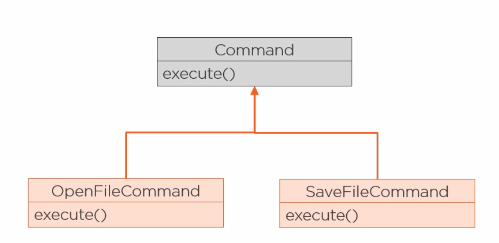
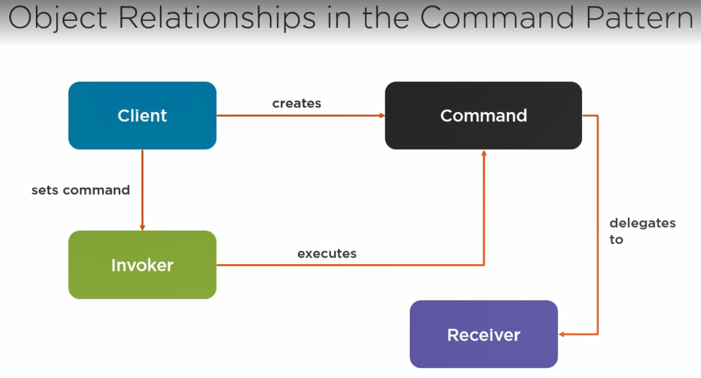
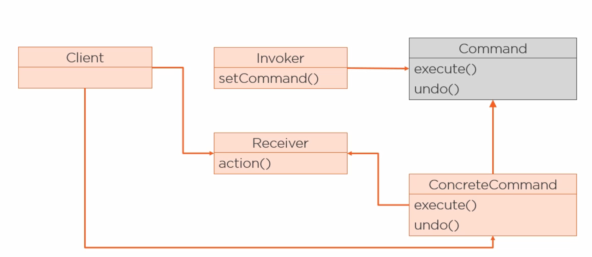
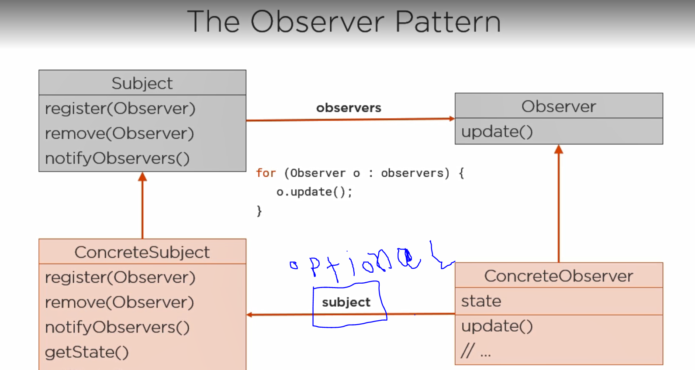

[<<< Course Page](../README.md)
-----
## <u>Behavioural Design Patterns</u>
###### Describe how objects and classes should communicate and their responsibility

- there is `11` Behavioural Patterns
    - only two of which use inheritance to distribute behaviour between classes :
      (_Class Behavioural patterns_)
        - `interpreter`:
            - represent a grammar as a class hierarchy and
                - and implement an interpreter as an operation on instances of the classes in the hierarchy

        - `template method`

    - the rest use object composition and are used to :
        - encapsulate behaviour inside an object to delegate functionality
            - ex. `iterator` , `visitor`
        - describe how a group of objects works to preform a task
            - ex. `Chain of responsibility`, `Mediator`,

---
---
### Examples for some of the most popular Behavioural Design Patterns

1. _**the State Pattern** :_
    - the same as the strategy pattern, but the intention is different
        - here we encapsulate State-specific logic (behaviour that change depending on the state)

---
2. _**the Command Pattern**_ :
    - encapsulate methods invocations
        - by parametrizing the method call

#### how to encapsulate methods invocation ?
1. define a super type (interface or abstract class)
    - that have one method (ex. execute)
2. for each command you want you create a subclass that override `the execute method`
   
---

----
- Note :
    - undo operations are often implemented using the command pattern
      

----------------
----------------
3. _**the Observer Pattern**_ :
- usage : 
  - notify one object or more when the state of another object change

- the diagram :
  

-----
----
4. _**the template method pattern**_ :
- does not use object composition
- usage :
    - define the steps for an algorithm allowing subclasses to provide :
        - the implementation for one or more step of the algorithm
    - can be used as an alternative for the Strategy pattern
        - because the strategy pattern change the entire algorithm using composition
        - and the template method uses inheritance to change part of the algorithm
---
#### what is the difference between an `abstract method` and a `hook` ?
- abstract methods :
    - required
    - must be customized
- hocks :
    - optional
    - abstract class may provide a default implementation

----
----

[<<< Course Page](../README.md)
-----