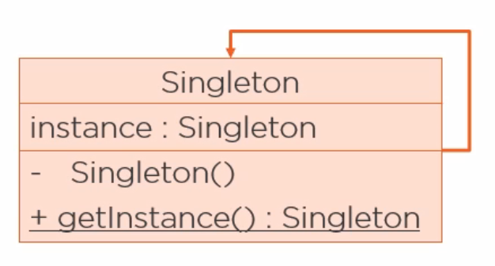
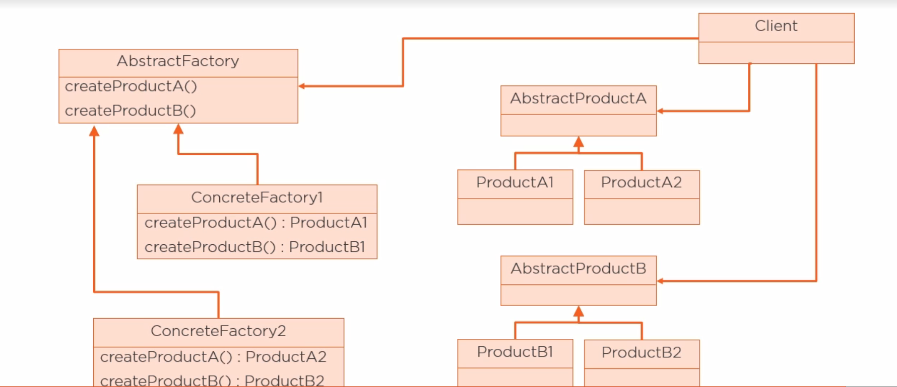
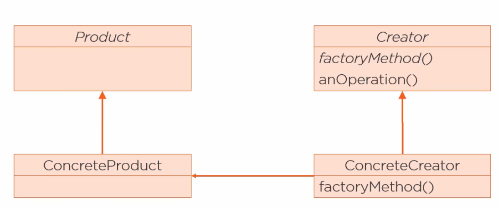
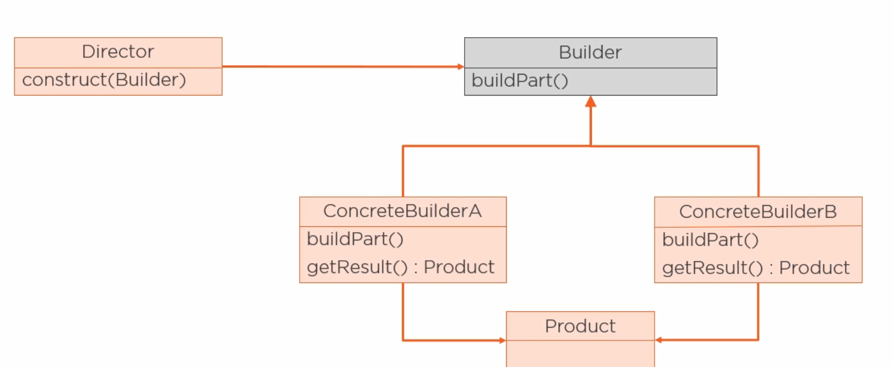

[<<< Course Page](../README.md)
-----
## <u>Creational Design Patterns</u>
- abstract the process of creating an object
    - how ? 
      - by hiding how objects are created and put together by exposing only their interface
    - why ? 
      - this gives flexibility in :
        - what objects gets created
        - when the objects get created
        - who create them
        - how they get created

----
- there is `5` Creational Design patterns :
    - Factory Method (the only Class Creational Pattern)
    - Abstract Factory
    - Creational.Builder
    - Singleton
    - Prototype
---
##### Note :
- what is a **prototype** ?
    - creating a new object by copying existing one (Cloning)
        - this is done in Java by :
            - implementing the `Cloneable` interface

-----------------------
### Examples :
#### The Singleton Pattern :
- intention :
    - ensure a class has only one instance
        - and providing a global access point to it

- How :
    1. make the constructor private
    2. a static attribute to hold the instance
    3. creat a static method to return the instance

----

----
#### notes :
- there are problems with the singleton Pattern that need to be handled :
    - multi threading
    - reflections
    - serialization
    - Class Loader

- you can implement the singleton in java using `enum`:
    - that give you a private constructor and is not affected by multi threading
    - but `enum` can not extend from other classes

-----
### the factory Patterns :
##### we have two factory patterns (factory method, abstract factory)
- intention :
    - delegate the creation of objects to a special class called factory
---

#### types :
1. abstract factory :
    - create families of related products (has several abstract products)
    - the abstract factory should have one `create method` for every abstract product

2. factory method [is a class Pattern (uses inheritance)] :
    - create a hierarchy of factories and a hierarchy of the products

----

3. simple factory :
    - so simple to be considered a pattern

----
### the Creational.Builder Pattern
##### offer a solution for the problem of constructing classes with many (optional) attributes

----
- **the problem of constructing classes with many optional attributes using :**
    - _Constructors_ :
        - for every optional attribute we add a constructor
        - the number of constructors can get very large quickly
    - _Setter methods_ :
        - the construction is split into multiple method calls
            - so there is no way to enforce all the required attributes
                - which may make the object state inconsistent

----
- **how does the builder pattern solve this ?!**
    - by separating the construction of the objects from its representation
        - which allow the construction process to create different representations

-----

---
---

[<<< Course Page](../README.md)
-----