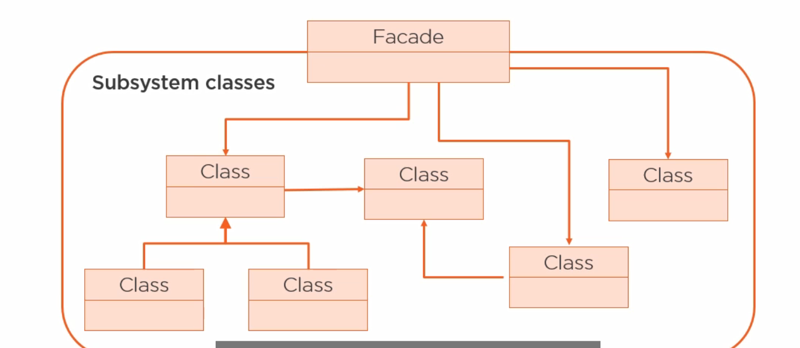
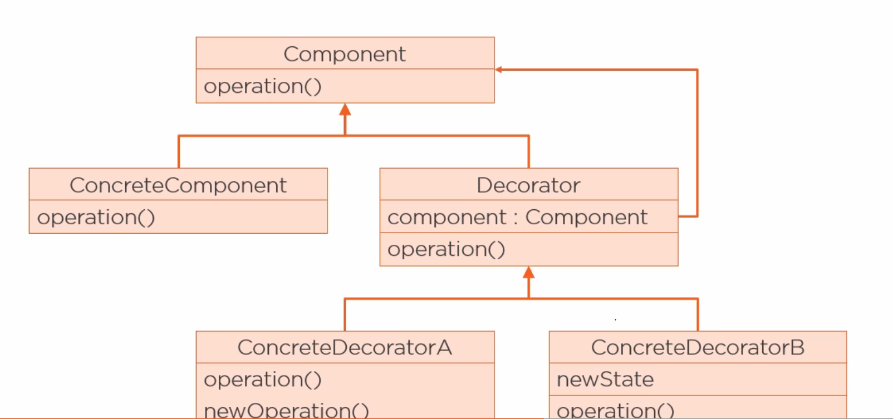
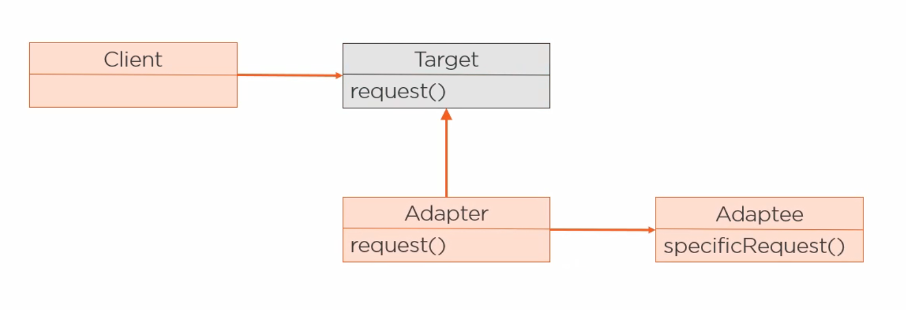
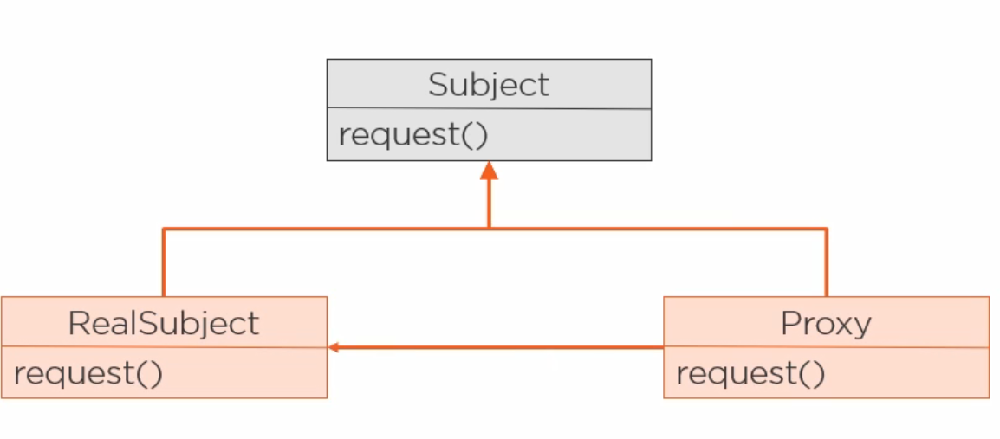

[<<< Course Page](../README.md)
-----
## <u>Structural Design Pattern (7)</u>
###### Describe how classes and objects are compost to form larger structures

- _**the Adaptor Pattern**_ is the only Class Structural Pattern
    - but can also be implemented using composition, so it is kinda of both!!..

- the others are object Structural patterns :
    1. Decorator
    2. Bridge :
        - uses object composition to :
            - breach two hierarchies (one for abstraction and the other for implementation)
                - to combine two different variation of these hierarchies
                - or compose the objects into complex structures
    3. Facade
    4. Proxy
    5. Composite
    6. FlyWeight

----
#### Examples :
- **_The Facade Pattern_**

- provide a simplified interface to use subSystems classes :
    - it does not encapsulate these classes , just provide a simple interface to access their functionality
- it decouple the client from the subSystem itself

---

----
- _**the Decorator Pattern**_ :

- intention :
    - adding the decorations dynamically in runtime instead of using inheritance in compile time

----

---
- Note :
    - this Pattern does not use inheritance for behaviour but
        - for type matching

----
- _**The Adaptor Pattern**_ :

- example for a use case :
    - when you try to integrate a legacy code into a new one

- use an adaptor instead of rewriting all your client-side code

- Note :
    - in java, you can not inherit from more than one class, so we use the object version of the adaptor pattern

- Note : here the target is an interface.
----
- The Proxy Pattern

- what's a proxy ?
    - a representative (surrogate) for another object that behave exactly like the real object
----
- what's the benefit of a proxy ?
    - allow you to add new functionality before calling the real object
---
- the goal of the proxy pattern :
    - to provide a surrogate (placeholder) for an object :
        - to control access to it
---    

---
- Common uses for proxies :
    - remote Calls :
        - to work as if they were local
    - Security :
        - to control access to resources based on the access permissions
    - Cache :
        - to speed the calls
    - Virtual Proxies :
        - for example initializing resources that are expensive to create
----
----
----
----

[<<< Course Page](../README.md)
-----