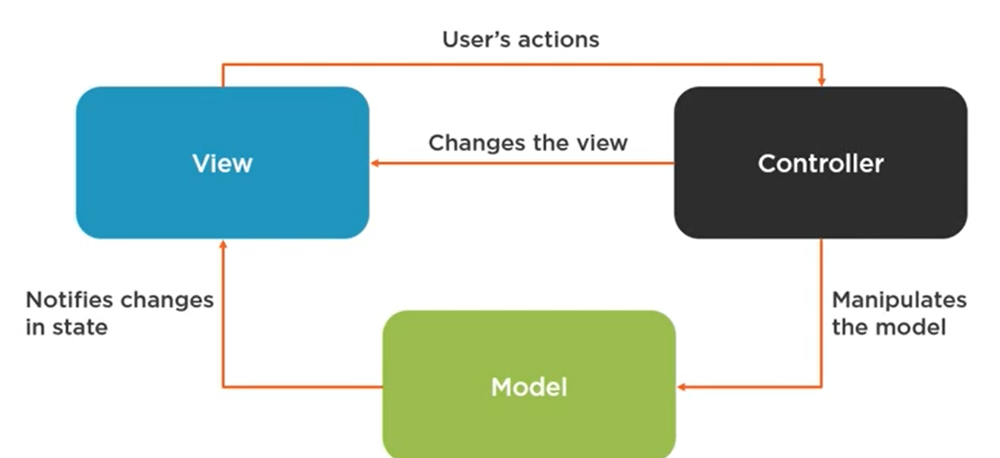

[<<< Course Page](../README.md)
-----
##  Exploring Other Design Patterns
### **_Enterprise Development Patterns_**
- Challenges that arise in enterprise Development :
    - _**Data Persistence**_ :
        - ex. transactions across multiple databases
    - _**Concurrency**_ :
        - allowing multiple users to access the same data at the same time without hurting performance or causing errors
    - **_integration with other applications_**

- **resources** :
    - https://martinfowler.com/articles/enterprisePatterns.html
        - future read (I think..?)

- example :
    - MVC :
        - an architectural pattern
        - intention :
            - separation the business logic and the presentation

----
- GOF patterns used in MVC :
    - **composite** :
        - the view compose its components and each competent compose what its subcomponents
    - **strategy** :
        - the view delegate the handling of the user actions to the controller
    - **observer** :
        - the model notify the controller, and the view when the state change

-----
----  
### _**Functional Programing patterns :**_
- in a functional pattern :
    - we hold references to a function (high order function) and pass other functions as arguments to it

##### what is a pure function ?!
- a function is pure if :
    - it has a single responsibility
    - has no side effect
    - is referentially transparent :
        - for the same input the output must be the same
----
- Notes :
    - functional programming is a different paradigm
        - the GOF patterns do not apply
        - also, java is not really a functional language
    - OOP Patterns are irrelevant in Functional programing

----
#### Functional Patterns Examples :
- MapReduce :
    - breaking tasks into smaller ones (map them)
        - and aggregate the result (reduce)

- Memoization :
    - Cache the result of a function and use it to speed up future calls with the same input

- Monad :
    - container type that defines :
        - rules of interactions
        - and provides composing function (to connect or compose other monads)
        - ex. in java : `Optional`

-----
---

#### **_Reactive Programming Patterns :_**
- reactive programming is event-driven
    - and focus on the flow of data

##### reactive programming Concepts  :
- Non-blocking programming :
    - the application does not wait for a request to finish to start handle another

- Asynchronous Programming :
    - handing  operations in parallel, or in the background
        - so the app can execute other things without waiting for these operations to finish

- Declarative  Programming :
    - allow us to emphasise the flow of data by :
        - describing what we need to do instead of :
            - writing it explicit

----
- reactive programming is based on :
    - **the observer and iterator patterns**

---
- reactive programming related Patterns:
    - Asynchronous patterns :
        - implemented in reactive programming libraries
            - ex. in java : RXJava
    - Reactive Design Patterns (reactive programming is not the same as reactive systems)
    
---
---

[<<< Course Page](../README.md)
-----
