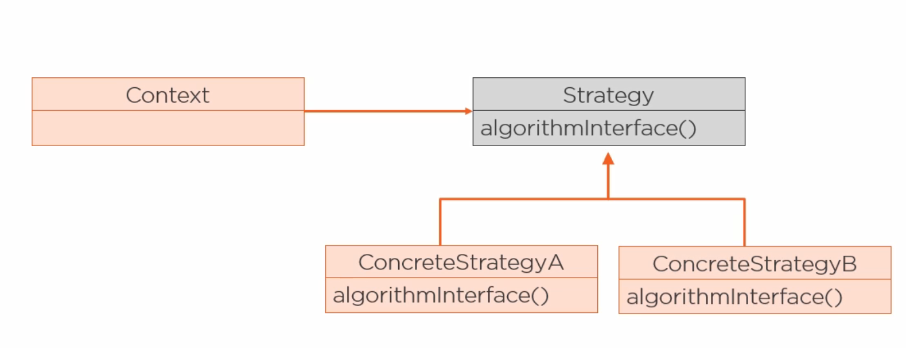

[<<< Course Page](../README.md)
-----
## <u> Why are Design Patterns important ?</u>

### why learn design patterns ?
- patterns capture expert knowledge
- patterns are reusable :
    - so you don't need to solve a problem that someone already solve
- help you to find the appropriate design
- help you in documentations and communication
    - because they provide shared vocabulary which is :
        - precise and complete

----
#### note :
- well-designed software is :
    - flexible
    - easy to maintain
    - reusable

- object-granularity :
    - define what should be in the object.

---
---
### Example :

###  Strategy Pattern :
- how it works ?
  - Define a family of algorithms
    - encapsulate each one and make them interchangeable

----   
- _benefit_ :
    - _**Lets the algorithm vary independent of the client that uses it**_

----
#### replacing inheritance with composition using _**the strategy pattern**_
- why ?
    - composition produce more flexible design

-----  
- usage :
    - swap out behaviour at run-time
    - change parts of the system independently of all other parts

-----
- the strategy pattern use the following principles :
    - encapsulate what changes
    - favour composition over inheritance
    - open-closed
    - program to an interface

-----
### the Diagram :

---
#### Note :
- subClass explosion :
    - happen when the number of classes needed to add a functionality to the class hierarchy
        - _Grows exponentially_

---
---
[<<< Course Page](../README.md)
-----