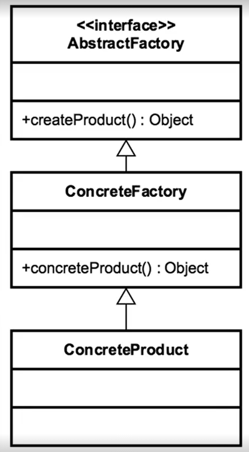

- [<<< Course Pages](../README.md)
---
# The Abstract Factory Pattern
###### Implemented as a factory of factory patterns

## Concepts
- is a factory of factories 

### Examples
- `DocumentBuilder`
- some frameworks
----
## Design 
- group collections of Factory together 
- every factory is responsible for its objects creation 
    - and all the factories are grouped by a common interface
    
- the abstract factory is build using composition 

- 
----
#### Code Example
- [the abstract factory code](../../../src/Creational/AbstractFactory)
----
## Pitfall
- the most complex creational design pattern
- there is a runtime switch 
    - the client choose what to do with it 
- pattern that contain other patterns
- problem specific 
- start as a factory and then get refactored to an abstract factory
---
## comparing the factory and the abstract factory
- Factory 
    - return different instances
        - has multiple constructors
    - interface Driven
    - adaptable to environment

- Abstract Factory 
    - Abstract environment
    - implemented with a factory
    - hides the factories 
    - built using composition

----
- [<<< Course Pages](../README.md)
---