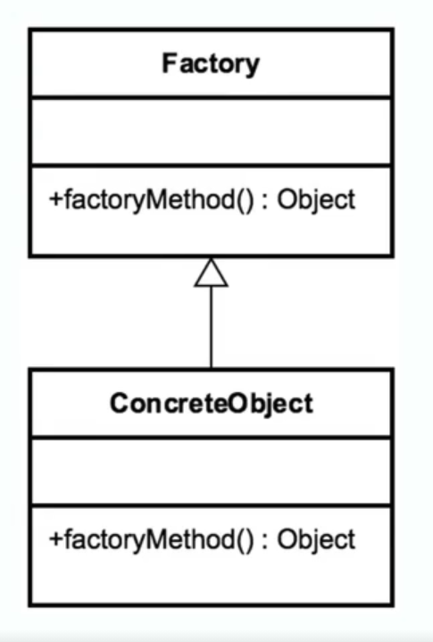

- [<<< Course Pages](../README.md)
---
# The Factory Method Pattern
## Concepts
- don't expose the initialization logic
    - defer the creation to a subclass
- the client only know about the interface of the factory 

- specified by architecture 
    - and implemented by the user

## Examples :
- `Calendar`
- `ResourceBundle`
- `NumberFormat`

## Design
- the Factory is responsible for creating the objects and managing their life cycle
- the objects created by the factory are referenced by 
  - a common interface

- the create method is parameterized 

----
### Code Example
- [the Factory demo](../../../src/Creational/Factory)
----
### Pitfalls
- the pattern is complex 
- the creation does not happen in the factory itself 
  - but in the subclasses of the type we are creating

- need to be designed from the beginning and not refactored in
---
### Comparing the Singleton with the Factory
- Singleton :
  - return the same instance
  - has one constructor with no args
  - no interfaces
  - no subclasses
  

- Factory :
  - return different types of instances
  - has multiple constructors
  - build on a common interface and subclasses
  - adapt to environments easily
      - (ex. a lot of frameworks are implemented using the Factory) 

----
- [<<< Course Pages](../README.md)
---