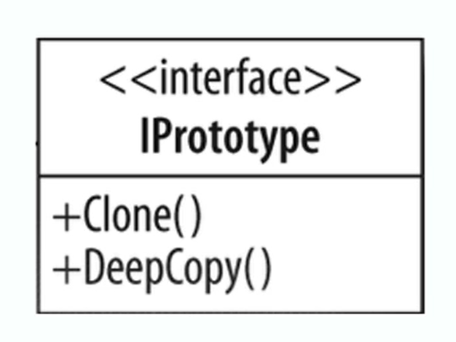

- [<<< Course Pages](../README.md)
---
# the prototype pattern
###### used when the type of object to create is determined by a prototypical instance which is cloned to produce another instance 
###### used to get a unique instance of the same object

----
### Concepts :
- avoid costly creation
- avoid subclassing
- doesn't use `new`
- often utilize an interface
- implemented with a registry
    - the original object is created and then kept in the registry

- often refactored in and not thought of in the design
- can help with preforming issues

#### Example
- `Java.lang.object.clone()`

---
### Design
- the pattern changes the way we call `new`
  - if object is expensive to create, and we could get what we need by coping the member variables
    - then use the prototype pattern
  
---
- implement the `clonable` interface
- each instance is unique in spite of being a copy

---
- costly construction is not handled by the client (not like the builder)
- can still utilize parameters for constructing if you need to  (not like the singleton)

----
#### what is the different between a deep and shallow copy ?
- a shallow copy the immediate properties 
- a deep copy everything including the object referenced 
-----

-----
- Note : `super.clone()` create a shallow copy
  - the `clone()` return an object, so you need to cast it
    - so it is recommended to create your own cloneable interface
----
### code example
- [the prototype example](../../../src/Creational/Prototype)
---
### Pitfalls 
- not clear when to use it
- used with other patterns :
  - you need a Registry with it
- the cloneable interface only do a shallow copy
---
#### comparing the factory with the prototype
- the Prototype
  - focus on lightweight construction
    - using a copy constructor or the clone method
  - copy an existing object
- the Factory
  - flexible objection construction 
    - has multiple constructors 
  - use `new` and create fresh objects

---

---
- [<<< Course Pages](../README.md)
---