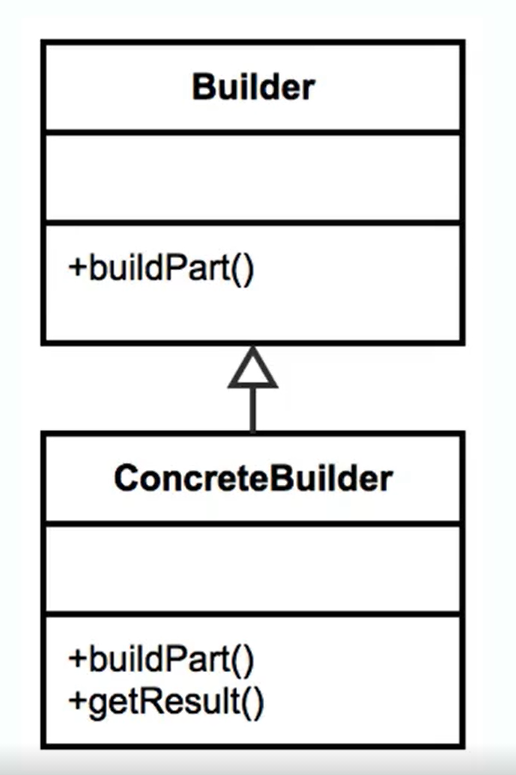

- [<<< Course Pages](../README.md)
---
# The Builder Pattern
## overview
- handle the construction of object that may contain a lot of parameters 
- makes the object immutable once it is constructed
## Examples in Java :
- `StringBuilder`
- `DocumentBuilder`
- `Locale.Creational.Builder`  
    - (a locale is a set of parameters that defines the user's language, region and any special variant preferences that the user wants to see in their user interface.)
### when to use the builder pattern ?
- when the construction of an object is complex
    - complex means lots of args. for the constructor or 
    - lots of setters and a contract that need to be guaranteed
- you can force immutability on objects
## Design
- 

### what  is the problem solved by the Builder pattern ?
- determining which constructor to use
------

##### telescoping constructors 
- the creation of multiple constructors with a parameters variation 
##### the Creational.Builder Pattern provide flexibility over telescoping constructors 
- by handing the constructors by an object instead of parameters 
----
- the builder pattern is implemented using a static inner class
  - that return an instance of the object it builds
  - and calls the appropriate constructor based on its state
---
- [implementation of the Builder Pattern](../../../src/Creational/Builder/LaunchOrder.java)
---
## pitfalls
- the objects created are immutable
- implemented with a static inner class
- should be designed early in the process and not refactored in
- add some complexity
---
### Comparing the builder and the prototype patterns
- Builder :
  - handle complex constructors
  - does not require an interface
  - can be a separate class
  - works with legacy code
- Prototype :
  - implemented around a clone method
  - avoids calling complex constructors
  - difficult to implement in legacy code
    - because the clone methods are focused around member variables and constructors  
      - so it is implemented inside the class it clones
----
- [<<< Course Pages](../README.md)
---