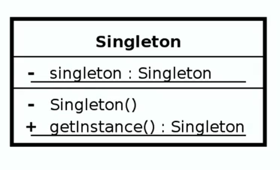

- [<<< Course Pages](../README.md)
---
# <u>Singleton</u>
- one of the most used design patterns. why?
    - because it is simple to implement
    - the type of problems it solves
----
## About 
- only one instance is created
- Guarantees control of a resource 
    - the instantiation is controlled by the implementation of the patterns
- usually lazy loaded
---
### Examples
- runtime
- Logger (is sometimes a factory)
- spring beans (TODO:: search?!)
- Graphic Managers
---
## Design 

- the Singleton class
  - is responsible for creating itself and managing its lifecycle
  - include a private instance
  - has a private constructor 
  - no parameters required for the constructor
        - if the constructor require parameters then it is a factory 
- Q. singleton is static in nature but is not implemented using static class why ?!
  - Ans. Singleton need to be threat safe and static does not Guarantee this
---
#### [example of a lazy loaded thread safe Singleton](../../../src/Creational/Singleton/DbSingletonTester.java)

----
## Pitfalls
- often overused
- Difficult to unit test
  - because it has a private constructor and doesn't expose an interface
- not thread-safe unless you make it
- can be confused for a factory
  - if it needs arguments it is not a singleton
----
- Note
  - `java.util.Calender` is not a singleton, but a prototype
---
## Difference between the singleton and the factory
- Singleton :
  1. Return same instance
    - one constructor method (no args.)
  2. No interface
- Factory 
  1. return various instances 
    - multiple constructors 
  2. interface driven
  3. adaptable to environment more easily (?!)
----
- [<<< Course Pages](../README.md)
---
