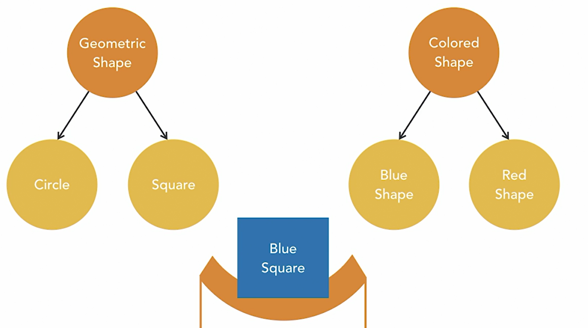

- [<<< Course Pages](../README.md)
---
# The Bridge Pattern
###### simplified inheritance structural making it more flexible and adaptable
## Example

----
### how to use it?
- create an interface (ex. coloredShape)
    - classes that implement this interface
- turn your large hierarchy into smaller hierarchy
    - classes in this hierarchy accept an object that implement the interface
    
#### example :
- create `coloredShape` interface and `green, blue, white` shapes that implement it
- Geometric shape is abstract and has `circle, square`
    - the shape accepts a coloredShape object and use it to choose the color

---
- [<<< Course Pages](../README.md)
---