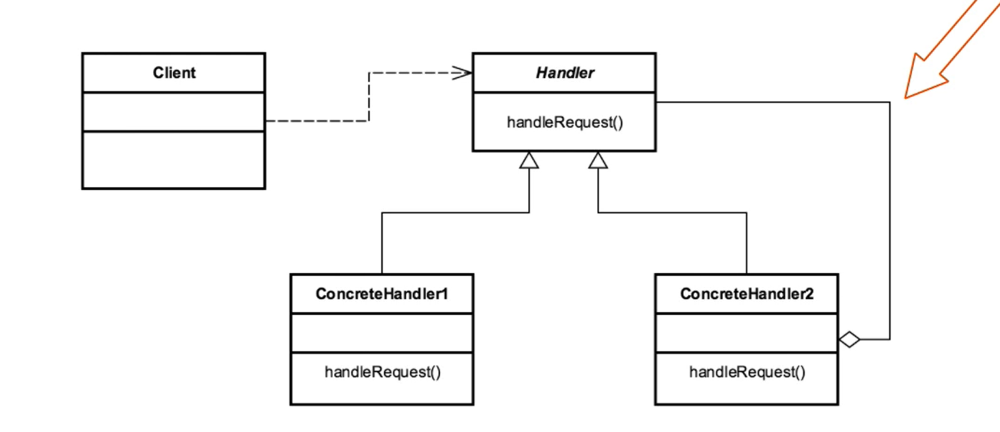

- [<<< Course Pages](../README.md)
---
# Chain Of Responsibility
###### decouple a request from a handling object in a chain of handlers

## Concepts :
- **Usage:** decoupling the sender and receiver objects
- Receiver contain a reference for the next receiver
    - not the whole chain
- promotes loose coupling
  

- the application continue if there is no handler for a given request

### Examples in Java :
- `java.util.logging.Logger`
-----
## Design :
- Chain of Receiver objects (ex. list)
- Handler is interface based (could be a class)
    - concrete Handler for each implementation
- each handler has a reference to the next link in the chain 
---
#### UML :

-----

### [Code Example](../../../src/Behavioral/ChainOfResponsibility/Demo.java)

----
## Pitfalls :
- it is not guaranteed that some object in the chain will handle the request
- runtime configuration risk
- the chain length can get large, and the performance could start degrade   
---
### comparing the chain of responsibility and the command patterns :
- the chain of responsibility
  - every handle is unique and know only about its successor 
  - can utilize the command pattern in a handler implementation

- the command pattern
  - commands are unique 
    - but it encapsulates all of its functionality
  - reversible or Trackable in nature  
----

---
- [<<< Course Pages](../README.md)
---