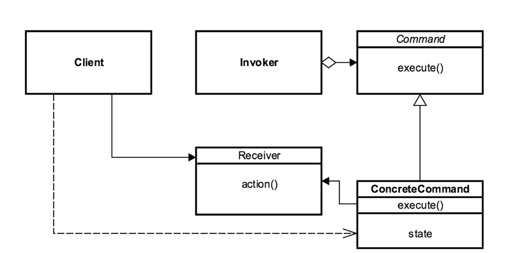

- [<<< Course Pages](../README.md)
---
# The Command Pattern
###### Encapsulate each request as an object
## Concepts :
- why use it ?
    - encapsulating requests as objects
    - Objects-oriented callback
    - decouple sender from processor
    - often used for `undo` functionality
    
### Examples in java :
- `java.lang.Runnable`
---
## Design :
- object per command
- a command interface with execute method
    - every command implement it
    

- can use reflection to decouple the client from the receiver

- consist of :
    - invoker
    - command
    - concrete command
    
---
### UML:

---
### 
[Code Example](../../../src/Behavioral/Command/CommandDemo.java)

---
## Pitfalls :
- Dependency on other patterns
- hard to handle multiple commands
- for `udo` functionality need to 
  - make use of Memento to handle state
- if you need to store history
  - use the prototype (to create copies to store in a list)
---
## Comparing the Command Pattern with the Strategy :
- Command
  - object per command
  - a command class contain `what` to do
  - encapsulate actions
  
- Strategy
  - Object per strategy
  - a Strategy class contain `how` to do
  - encapsulate algorithm

    

---
- [<<< Course Pages](../README.md)
---