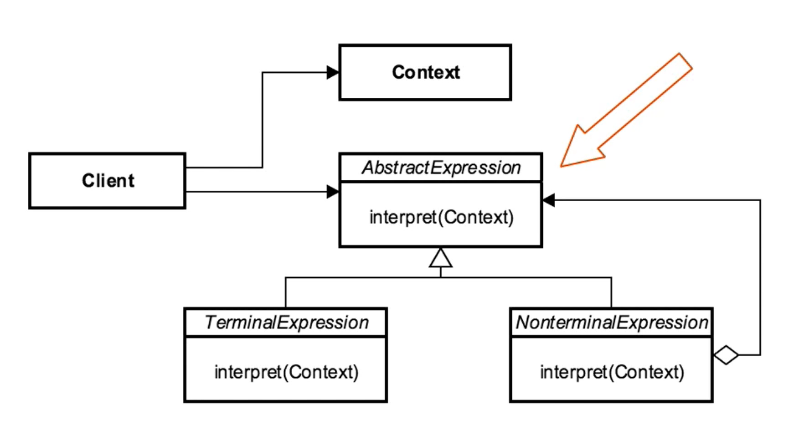

- [<<< Course Pages](../README.md)
---
# The Interpreter Pattern
###### Represent the grammar of a language
## Concepts :
- Represent grammar
  - compiler used it to parse source code
- interpreter a sentence
- Map a domain 
  - define a language to do things 
- used to define AST(i.e. abstract syntax tree)

### Examples in Java :
- `java.util.pattern`
- `java.text.format`
---
## Design :
- AbstractExpression (abstract base class)
    - an interface to execute an operation
        -  `interpret` method

- Expressions types :
    - Terminal expression
        - does not contain other expression
    - NonTerminal expression
        - include other expressions
    

- consist of :
    - context
    - AbstractExpression
    - Terminal Expressions
    - NonTerminal Expressions
    - client
---
### UML :

---
### [Code Example](../../../src/Behavioral/Interpreter/InterpreterDemo.java)

---
## Pitfalls
- Complexity
- class per rule
- Use of other patterns
- adding a new variant require changing every variant of this class
- specific for every case
----
## Comparing the Interpreter and the Visitor :
- Interpreter :
    - has access to properties
    - functions are method
    - adding new functionality changes every variant
    

- Visitor :
    - Need observer functionality to access properties
    - functionality is in one place
    - adding new variant require changing every visitor

---
- [<<< Course Pages](../README.md)
---