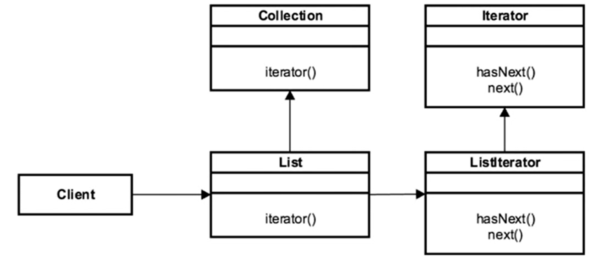

- [<<< Course Pages](../README.md)
---
# The Iterator Pattern
###### provide navigation without exposing the structure of the object

## Concepts :
- Travers a container
- Doesn't expose the underline structure 
- Decouple the data from the algorithms used to travers it
- Sequential

### Examples in Java :
- `java.util.Iterator`
- `java.util.Enumerator`
---
## Design :
- interface based
- Factory method based
    - you get an instance of the iterator
- independent, but fail fast
    - `fail fast`  means :
      - two iterators can't modify the underline object without a error being thrown   
    - Note :
        - `Enumerators` are fail-safe

### UML

---
[Code Example](../../../src/Behavioral/Iterator/IteratorDemo.java);

---
### How to implement ?
- implement the `Iterable` interface
    -  the `iterator` method return an `Iterator` object
- define the `Itertor` class (can be an anonymous class)
    - should have at least two methods :
        - `hasNext`, `next`
--------
## Pitfalls :
- you don't have access to indices
- Directional 
    - it only go forward
        - some implementation ofter go both directions
- can be slower than a loop in some cases
----
## comparing the Iterator with the for loops :
- Iterator :
    - interface based
        - algorithms are removed 
    - no index available
    - prevent concurrent modification (??)
    
- For Loops
    - traversal is on the client
    - expose an index
    - doesn't change the underline object
    - typically slower
----
---
- [<<< Course Pages](../README.md)
---