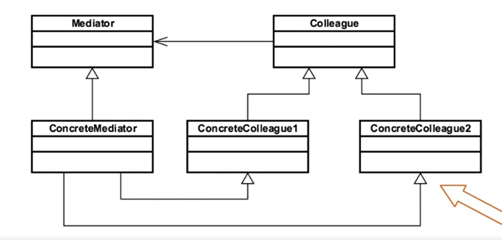

- [<<< Course Pages](../README.md)
---
# The Mediator Pattern
###### objects speak to one another without them referring to each other explicitly
## Concepts :
- achieve Loose Coupling
- used when we have well-defined objects that communicate in complex ways
- allow us to create reusable component
- act as a Hub/Router

### Examples in Java :
- `java.util.Timer`
- `java.lang.reflect.Method#invoke()`
---
## Design 
- interface based with a concrete class
    - using the interface allow us to use a different Mediator based on the case
    
- Minimize inheritance
- Mediator knows about all the `colleagues`

### UML :

---
[code example](../../../src/Behavioral/Mediator/MediatorDemo.java)

---
- [<<< Course Pages](../README.md)
  - decouple the command from the objects though the mediator
----
## Pitfalls :

---