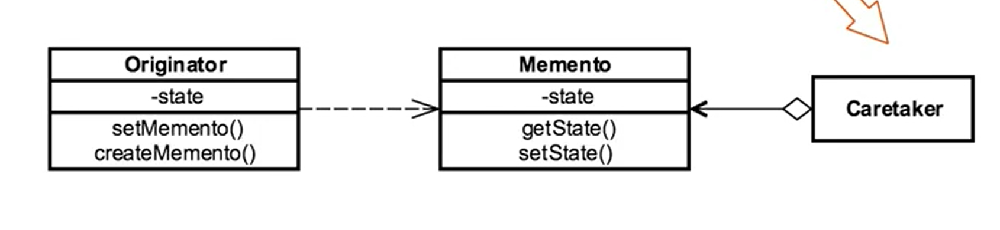

- [<<< Course Pages](../README.md)
----
# The Memento Pattern
###### externalize an object state to provide rollback functionality

## Concepts :
- Restore an object to previous state
- Externalizing intern state
    - be careful to not violate Encapsulation
- used to :
    - implement `undo/rollback`
    
- shield complex internal from other objects

### Example in Java :
- `Java.util.Date`
-  `Java.io.Serializable`
---
## Design :
- _**class based**_
- there are three rolls :
    - the _**Originator**_
        - the object we want copy of
    - the **_CareTaker_**
        - manage the copies (i.e. the mementos) that we have created
    - the **_Memento_**
        - the copy of the originator we want to store
        - consist of a `magic cookie` 
            - **Magic Cookie** :
                - the collections of fields needed to recreate the state of an object
                - stored in the memento
### UML :

---
### 
[Code Example](../../../src/Behavioral/Memento/MementoDemo.java)

----
## Pitfalls
- can be expensive
- Care taker history should be deleted at some point
- may Expose information
----
## Comparing the Memento with the Command :
- Memento :
    - capture states
        - every state is independent
    - create a history with the caretaker 
- Command :
    - Capture requests
        - independent request
    - can implement history but not the focus of the pattern
        - **side benefit**
    

----
- [<<< Course Pages](../README.md)
----

