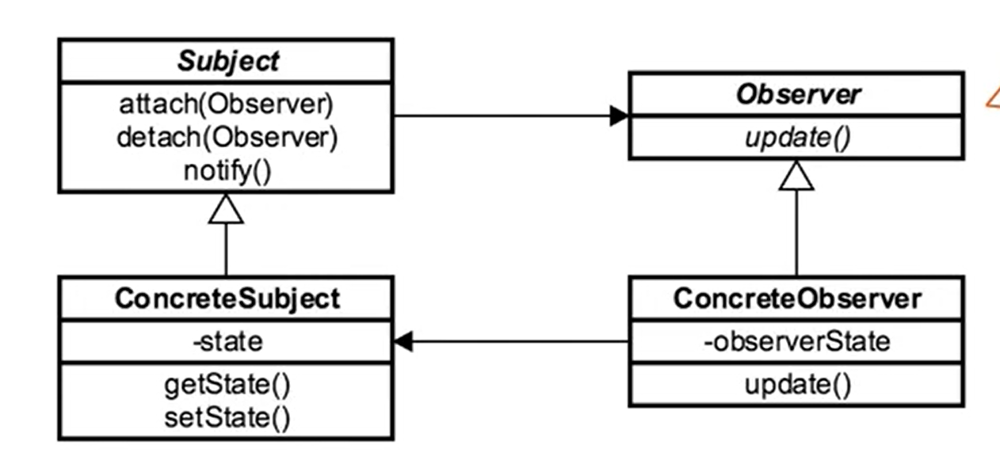

- [<<< Course Pages](../README.md)
----
# The Observer Pattern
###### used for decoupling objects when we have a subject that need to be observed by one or more observers

## Concepts :
- used when an object has one or many observers
- decouple objects
- add event handling capability
---
- Note : `the observer work in sync. where the pub/sub model work in a Async way`
---
- used in MVC where the view is event driven

### Example in java :
- 'java.util.Observer'
- 'java.util.EventListener'
---
## Design :
- there is a `Subject` that need to be observed
    - in java the subject implement `Observable` interface

- Observer
    - interface based with different concrete implementations

- #### Consist of :
    - Subject
    - Concrete Subject
    - Observer
    - Concrete Observer
---

----
## Pitfalls :
- unexpected updates
- large size consequences
- not knowing what have changes
  - which can make debugging hard
---
### Comparing the Observer with the Meditor
- Observer :
  - one to many relation
  - decouple objects 
  - uses a broadcast communication

- Meditor :
  - one to one to many
  - used for decoupling
  - handle complex communication
  - can be implemented with an observer
    - the mediator can be part of the Subject
-----

---
- [<<< Course Pages](../README.md)
----
