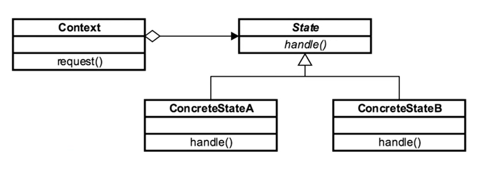

- [<<< Course Pages](../README.md)
----
# The State Pattern 
###### Used to represent State in an application 
###### Simplify cyclomatic complexity
## Concepts :
- Localize State behaviour
- store the State in an object instead of variable around your application
- Separate the State we are in from where are we in the application
- follow the Open-close principle
---
## Design :
- use an abstract class, or an interface
    - often an abstract class
        - why ?
            - because the different states an object can be in do not apply to every instance of the state class
- the Context is unaware of the different states 

#### Consist of :
- context
- state
- concert state
---

----
[Code Example](../../../src/Behavioral/State/StateDemo.java)
---
## Pitfalls :
- you must know the states of your applications
- More classes
- must keep logic out of the context
- should know what trigger state changes
---
### Comparing the State with the Strategy
- **State** :
    - interface based
    - a state knows only about its transitions (the next state)
    - class per state
- **Strategy** :
    - interface based
    - focus on algorithms instead of state representations
    - algorithms are independent
    - class per algorithm
    
---
- [<<< Course Pages](../README.md)

