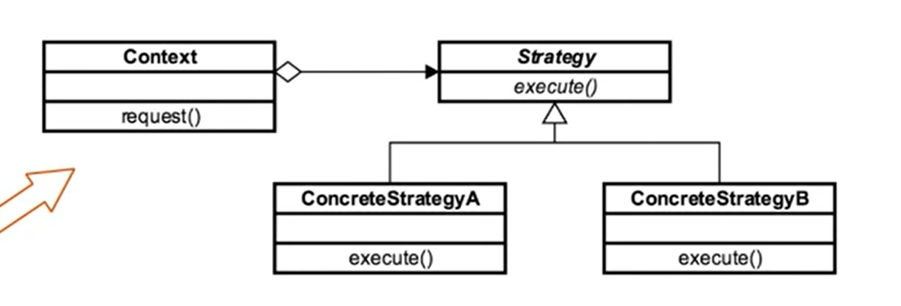

---
- [<<< Course Pages](../README.md)
---
# The Strategy Pattern
###### enable choosing the Strategy or algorithm at runtime
## Concepts :
- used to eliminate conditional statements
- Behaviour encapsulated into classes
- used if it is difficult to add new strategies
- client is aware of the strategies and choose the one to use

- removes if/else conditionals
- strategies are independent
#### Examples in Java :
- "Java.util.Comparator"
---
## Design :
- build with an abstract class
    - concrete class per strategy
#### Consist of :
- Context
- Strategy
- Concrete Strategy
----

---
[Code Example](../../../src/Behavioral/Strategy/StrategyDemo.java)
---
## Pitfalls
- the client need to be aware of the Strategies available
- the number of classes
---
#### comparing the Strategy with the State ;
- Strategy :
  - focus on algorithms
  - interface based
  - strategies do not know about each other
  - class per strategies
- State :
  - interface based
  - a state know about the next state
  - class per state

---
- [<<< Course Pages](../README.md)

