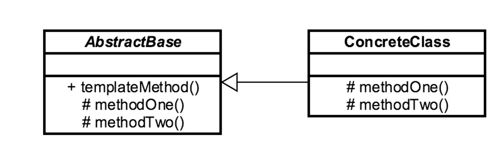

---
- [<<< Course Pages](../README.md)
---
# The Template Method
###### define an algorithm then allow subclasses to modify part of the algorithm
###### Guaranteed Algorithm adherence

## Concepts :
- good for Code reuse
- common on libraries and frameworks
    - used in IOC (inversion of control)

### Examples in java :
- `Java.util.Collection#sort()`
- `Java.util.AbstractList#indexof()`

---
## Design :
- Abstract Base class
- the base class calls the child class

- hooks can be overridden and operation must be overridden
---

---
#### [Code Example](../../../src/Behavioral/TemplateMethod/TemplateDemo.java)

---
## Pitfalls :
- some methods need restrict access
- hooks and operations should be implemented correctly
- can create confusing class hierarchy
- can make a difficult program flow
---
### Comparing the Template Method with the Strategy
- Template Method :
  - same algorithm, different implementation
  - class based
  - choosing is at compile time
  

- Strategy :
  - Algorithm per strategy
  - interface based
  - choosing at runtime

---
- [<<< Course Pages](../README.md)

