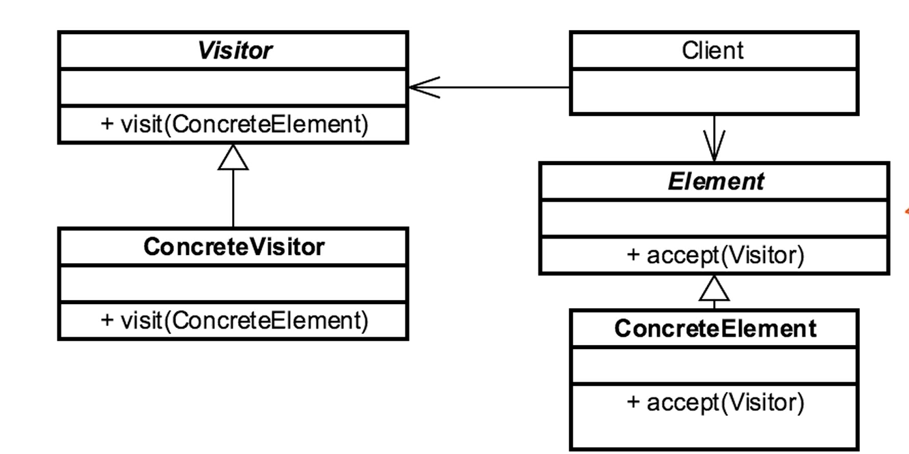

- [<<< Course Pages](../README.md)
---
# The Visitor Pattern
###### Separate an Algorithm from object structure

## Concepts :
- separate an algorithm from Object
    - because :
        - expecting a lot of change
        - adding new features

- maintain the open-close principles

- the visitor contains the changes and specializations instead of chaining the original subject

#### Examples in Java :
- `Java.lang.model.Element`
- `Java.lang.model.ElementVisitor`
---
## Design :
- interface based
- must be considered from the beginning
- the applications have elements :
    - these are the pieces we expect to change and add functionality to
        - we implement a visitor in each element
            - every element accept a visitor
            - the visitor know every element

- consist of :
    - Visitor
    - concrete visitor
    - element
    - concrete element 
---

---
### [Code Example](../../../src/Behavioral/Visitor/VisitorDemo.java)

---
## Pitfalls :
- you have to plan for adaptability

- indirection and somewhat confusing
    - because of the notion of using an object outside its domain

- you may need to implement the adaptor pattern
    - because some visitor does not implement all the methods
---
## Comparing the Visitor with the Iterator :
- Visitor :
    - interface based
    - externalize changes
    - can have multiple visitors
- Iterator :
    - interface based
        - often anonymous
    - encapsulate navigation
    - often Singular

---
- [<<< Course Pages](../README.md)
