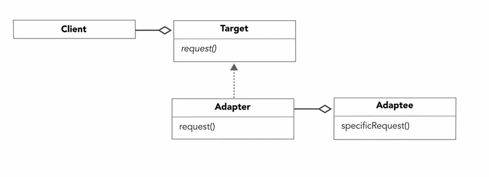

- [<<< Home Page](../../README.md)
---

# Design pattern

### Benefits :
- you will not need to reinvent the wheel
- help  you build resilient code
- help you prepare for future additions 
----

#### Design principle :
- **Encapsulate what varies** 
    - identify the aspects of your application that changes and separate them from the ones that don't
---
- **Program to an interface not an implementations** 
    - clients remain unaware of the kind of objects they are using as long as the interface adhere to the interface the client expect 
---
- **Favor composition over inheritance**
  - classes should achieve code reuse using composition rather than inheritance from a superclass
  - this lead to more flexible design
---

### The Strategy Pattern
- define a family of algorithms 
  - encapsulate each one and make them interchangeable
    - this let the algorithms vary independent of the client that use them

    
---
---
### The Adaptor Pattern :
- convert the interface of a class into another interface that the client expect
  - which allow classes that have incompatible interfaces to work together

---
---
### The Observer Pattern :
- a one-to-many dependency between objects so that when one object state changes all of its dependants
  get notified automatically

---
---
- #### Loose Coupling Principle :
  - strive for loosely coupled design between objects that interact
---
---
- #### The Open-Closed Principle :
  - classes should be open for extension but close for modification
---
---
### The Decorator Pattern :
- attach additional functionality to an object dynamically

- provide a flexible alternative to subclassing for extending functionality

---
---
### The Iterator Pattern :
- provides a way to access the elements of an aggregate object sequentially without 
    exposing its underline representation

---
---
- #### The Single Responsibility Principle
  - a class should have only one reason to change
---
---
### The Factory pattern :
- decouple the process of creating objects from the client that create them

- #### The Simple Factory :

- #### The Factory  Method Pattern :
  - define an interface for creating an object but lets subclasses decide which class to instantiate
---
---

