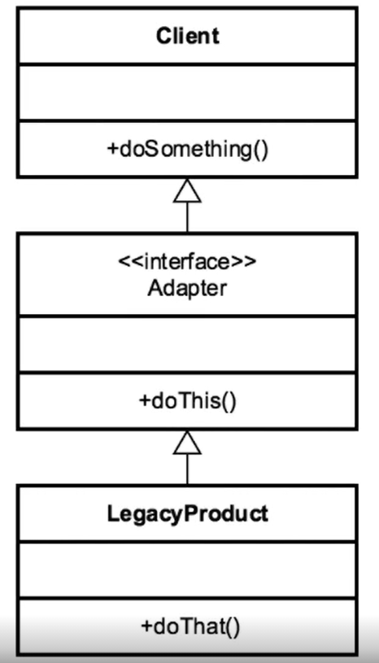

[Course Page >>>](../README.md)
---
# The Adaptor Pattern
###### connect new code to legacy code without the need to change the interface of the old code

## Concepts 
- convert an interface into another interface
- translate requests from the client to the code we are adapting to

#### Examples in Java :
- the array to list conversion
- Streams

---
## Design :
- client centric

---

## Comparing the Adaptor with the Bridge :
- Adaptor Pattern :
    - work after the code is designed
    - retrofitted to make unrelated classes work together
    - work with legacy code
    - provide a different interface 
    

- Bridge :
  - Designed upfront
  - makes abstraction and implementation vary independently
----
[Course Page >>>](../README.md)
---
