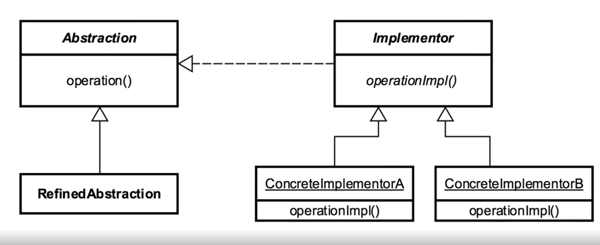

[Course Page >>>](../README.md)
---
# The Bridge Pattern

## Concepts :
- decouple abstraction and implementation
- changes in the abstraction won't affect the client

### Examples :
- JDBC driver
---
## Design :
- the application is designed to accept changes from both sides

- consist of :
    - Abstraction
    - Implementor
    - Refined Abstraction
    - concrete Implementation
  

---
## Pitfalls :
- increase complexity
- Conceptually difficult to plan
---

---
[Course Page >>>](../README.md)
---
