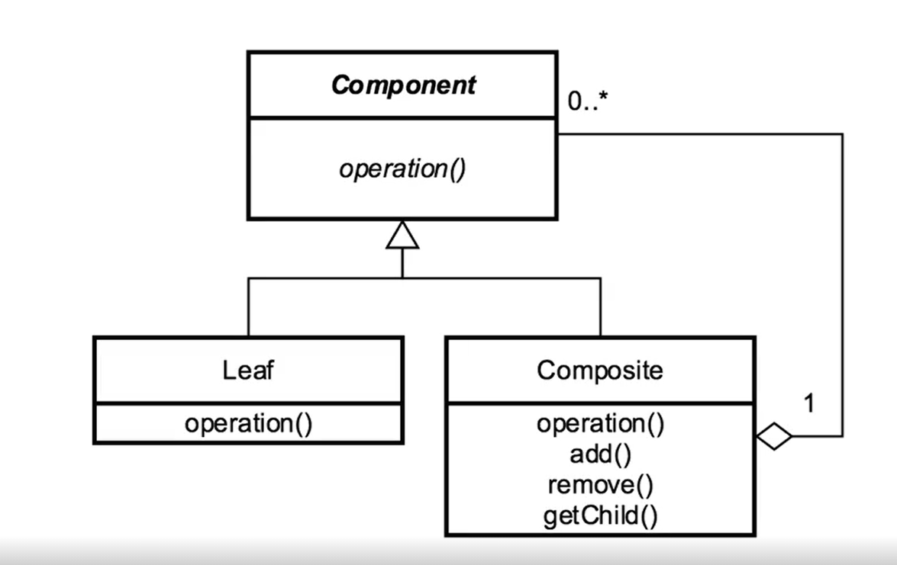

[Course Page >>>](../README.md)
---
# The Composite Pattern 
###### deals with tree structures of information

## Concepts :
- components represent part of, or the whole structure
    - both are treated the same

- compose objects into tree structure 

- individual objects are treated as composite
    - same operations are applied on individual and composites

### Examples in Java :
- `java.awt.Componet`
- restful services GETs
---
## Design :
- tree structured 
    - the root start with a component (leaf or composite of objects)
- composite knows abouts its child objects

----
## Pitfalls :
- can over simplify a system
- difficult to restrict
  - has to relay on runtime checks
  
- implementation can possibly costly
----
## Comparing the Composite and the Decorator 
- Composite :
  - tree structured
    - leaf and component are treated the same
  
- Decorator :
  - an object contains another object (Composition)
  - modify behaviour of the object it contains
  
---
[Course Page >>>](../README.md)

---