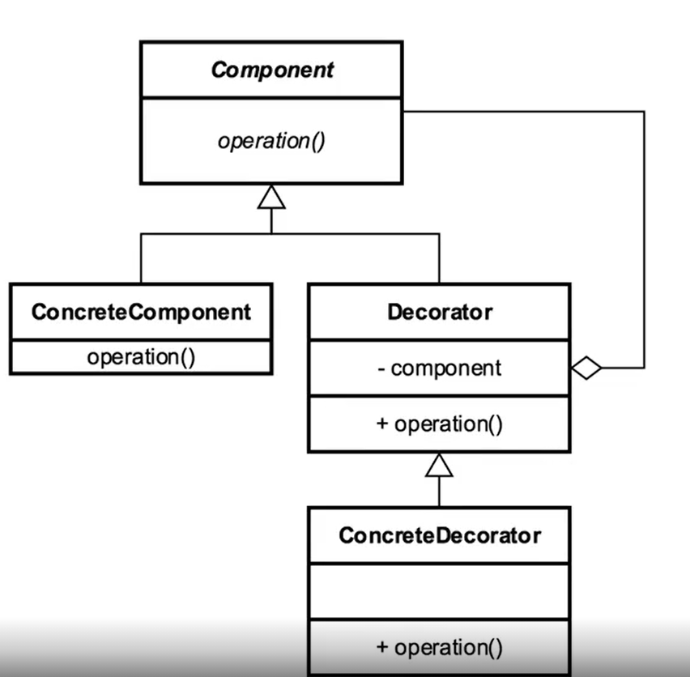

[Course Page >>>](../README.md)

---
# The Decorator Pattern
###### add functionality using composition

## Concepts
- add behaviour without affecting other objects
- follow the single responsibility principle
- compose behaviour Dynamically

### Example in Java :
-  `java.io.inputStream`
---
## Design 
- utilize inheritance and composition
- alternative to subclassing

---
## Pitfalls
- new classes for every feature
    - a lot of multiple little objects
- often confused with simple inheritance
---

---
[Course Page >>>](../README.md)

---