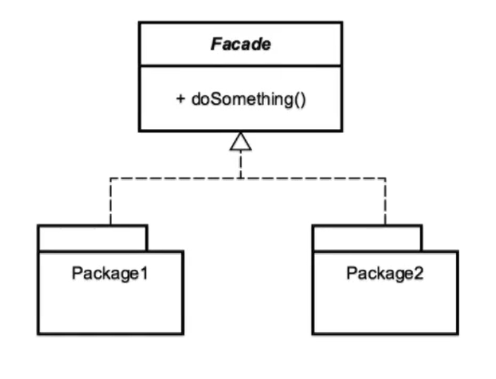

---
[Course Page >>>](../README.md)

---
# The Facade Pattern
###### provide an easy-to-use interface to  a hard-to-use system

## Concepts 
- make an api easier to use
    - simplify the interface
- reduce dependency on outside code

### Example in Java :
- `Java.net.URL`
---
## Design 
- the facade is a class that utilize composition
    - should not have a need for inheritance

---
## Pitfalls
- typically, used to clean up code
  - if you are using it you should look at the design of your api

---
## Comparing the Facade with the Adaptor 
- Facade 
  - simplify an interface
  - work with composites

- Adaptor
  - modify behaviour
  - provide a different interface
----

---
[Course Page >>>](../README.md)

---