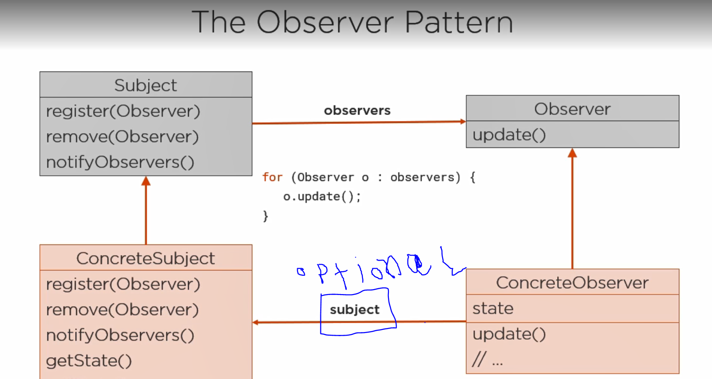
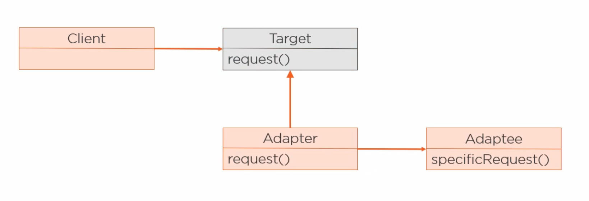
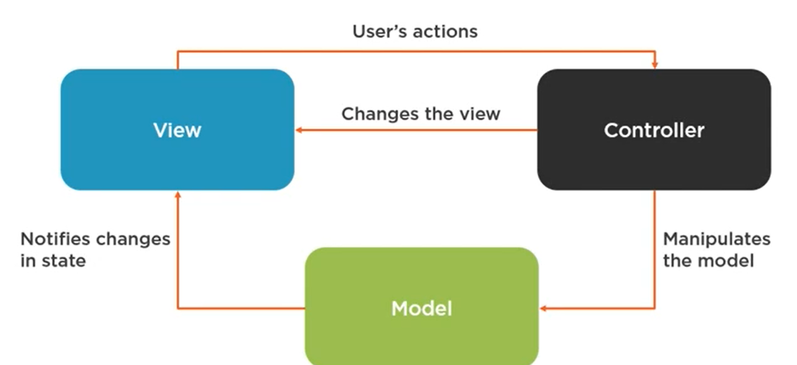

# <u>Design Patterns</u>
###### a solution to a problem in a context

----
### Table of content :
- understanding design patterns (Done)
- why are design patterns important? (Done)
- Behaviour Design Patterns (Done)
- Creational Design Patterns (Done)
- Structural Design Patterns (Done)
- other design patterns in java (Done)
- summary + tips + next step
-----
## Understanding Design Patterns 
_**Definition**_ :
- _**a reusable and named solution to a recurring problem in a context**_
---
1. Context :
    - the situation in which the pattern applied
    
2. problem :
    - what are you trying to achieve and any constrains of the context
    
3. Solution :
    - what solve the problem in that context
    
Notes :
- a pattern needs to be applied to a recurring problem 
- the solution needs to be reusable 
---------------------------
### OOP Building Blocks :
1. abstraction
2. encapsulation
3. inheritance
4. polymorphism 

### OOP Principles (SOLID):
- Single Responsibility :
  - a class should only do one thing 
        - which give it only one reason to change
- Open-Closed :
  - a class should be open for extensions and closed for modifications 
- Liskov substitutions :
  - you can substitute your base class with any of its subClasses without errors
- interface segregation :
    - you should  define  fine-granted interfaces as specific for the client that is going to use them 
        - then you can use every small interface where you need it 
- Dependency Injection
    - high-level modules should not depend on low-level modules
        - both should depend on abstractions (interfaces and abstract classes)
------
- Don`t repeat yourself (DRY)
- Encapsulate what changes
- Favor composition over inheritance
- program to an interface not an implementation
----
----

### you can consider :
- Principles `as` low-level 
- Patterns `as` high-level
-----

### Pattern Classifications 
- Patterns are classified by :
    1. purpose :
        - Creational (5):
            - provide a way to decouple the code that create the object from the object itself
        - Behavioural (11):
            - concerned with how objects interact and distribute responsibility 
        - Structural (7):
            - composing classes and objects to create new structure or functionality
    2. Scope :
        - class (4) :
            - how relation between classes are described via inheritance
        - object :
          - how relation between objects are described via composition
-------
- _**Note**_ :
    - composition is at runtime while inheritance is at compile time :
        - which make relation via composition more dynamic and flexible
    
------
-----
-----
-----
## <u> Why are Design Patterns important ?</u>

### why learn design patterns ?
- patterns capture expert knowledge
- patterns are reusable :
    - so you don`t need to solve a problem that someone already solve
- help you find the appropriate design 
- help you in documentations and communication 
    - because they provide shared vocabulary which is :
        - precise and complete
    
----
#### note :
- well-designed software is :
    - flexible
    - easy to maintain
    - reusable
    
- object-granularity :
    - what should be in the object.
    
---
---
### Example :
#### replacing inheritance with composition using _**the strategy pattern**_
- why ?
    - composition produce more flexible design
    
##  Strategy Pattern :
- Define a family of algorithms 
    - encapsulate each one and make them interchangeable 
 
----   
- _benefit_ : 
  - _**Lets the algorithm vary independent of the client that uses it**_
  
-----  
- usage :
    - swap out behaviour at run-time
    - change parts of the system independently of all other parts
    
-----
- the strategy pattern use the following principles :
    - encapsulate what changes
    - favour composition over inheritance
    - open-closed 
    - program to an interface
    
-----
### the Diagram :

---
#### Note :
- subClass explosion :
    - happen when the number of classes needed to add a functionality to the class hierarchy 
        - _Grows exponentially_ 
    
---
---
---
---
## <u>Behavioural Design Patterns</u>
###### Describe how objects and classes should communicate and their responsibility 

- there is 11 Behavioural Patterns
    - only two of which use inheritance to distribute behaviour between classes :
            (_Class Behavioural patterns_)
        - `interpreter`:
            - represent a grammar as class hierarchy and 
                - and implement an interpreter as an operation on instances of the classes in the hierarchy
            
        - `template method`
    
    - the rest use object composition and are used to :
        - encapsulate behaviour inside an object to delegate functionality 
            - ex. `iterator` , `visitor` 
        - describe how a group of objects works to preform a task 
            - ex. `Chain of responsibility`, `Mediator`,
    
---
---
### Examples for some of the most popular Behavioural Design Patterns
    
1. the State Pattern :
    - the same as the strategy pattern, but the intention is different
        - here we encapsulate State-specific logic (behaviour that change depending on the state)
    
---
2. the Command Pattern :
    - encapsulate methods invocations 
        - by parametrizing the method call 
          
#### how to encapsulate methods invocation ?
1. define a super type (interface or abstract class)
    - that have one method (ex. execute)
2. for each command you want you create a subclass that override `the execute method`
    
---
    

----
- Note :
    - undo operations are often implemented using the command pattern

      
----------------
----------------
3. the Observer Pattern :
- usage : notify one object or more when the state of another object change 

- the diagram :

  
-----
----
4. the template method pattern :
- does not use object composition 
- usage :
    - define the steps for an algorithm allowing subclasses to provide :
        - the implementation for one or more step of the algorithm
    - can be used as an alternative for the Strategy pattern
        - because the strategy pattern change the entire algorithm using composition 
        - and the template method uses inheritance to change part of the algorithm
    
#### what is the difference between an `abstract method` and a `hook` ?
- abstract methods :
    - required
    - must be customized 
- hocks :
    - optional
    - abstract class may provide a default implementation 
    
----
----
----
----
## <u>Creational Design Patterns</u>
- abstract the process of creating an object
    - how ? by hiding how objects are created and put together by exposing only their interface
        - why ? this gives flexibility in :
            - what objects gets created
            - when the objects get created
            - who create them 
            - how they get created
    
----
- there is **_5_** Creational Design patterns :
    - Factory Method (the only Class Creational Pattern)
    - Abstract Factory
    - Builder
    - Singleton
    - Prototype
    
##### Note :
- what is a prototype ?
    - creating a new object by copying existing one (Cloning)
        - this is done in Java by :
            - implementing the `Cloneable` interface
    
-----------------------
### Examples :
#### The Singleton Pattern :
- intention :
    - ensure a class has only one instance 
        - and providing a global access point to it 
    
- How :
    1. make the constructor private 
    2. a static attribute to hold the instance
    3. creat a static method to return the instance
    
----

----
#### notes :
- there are problems with the singleton Pattern that need to be handled :
    - multi threading
    - reflections
    - serialization
    - Class Loader
    
- you can implement the singleton in java using `enum`:
    - that give you a private constructor and is not affected by multi threading
    - you can not extend from other classes
    
-----
 ### the factory Patterns :
##### we have two factory patterns (factory method, abstract factory)
- intention :
    - delegate the creation of objects to a special class called factory 
---

#### types :
1. abstract factory :
    - create families of related products (has several abstract product)
    - the abstract factory should have one `create method` for every abstract product

  

2. factory method [is a class Pattern (uses inheritance)] :
    - create a hierarchy of factories and a hierarchy of the products

   
  

----

3. simple factory :
    - so simple to be considered a pattern
    
----
### the Builder Pattern
##### offer a solution for the problem of constructing classes with many (optional) attributes 

----
- **the problem of constructing classes with many optional attributes using :**
    - _Constructors_ :
        - for every optional attribute we add a constructor   
        - the number of constructors can get very large quickly 
    - _Setter methods_ :
        - the construction is split into multiple method calls 
            - so there is no way to enforce all the required attributes
                - which may make the object state inconsistent 
    
----
- **how does the builder pattern solve this ?!**
    - by separating the construction of the objects from its representation 
        - which allow the construction process to create different representations 
    
-----

----
---
---
---
### <u>Structural Design Pattern (7)</u> 
###### Describe how classes and objects are compost to form larger structures  

- _**the Adaptor Pattern**_ is the only Class Structural Pattern
  - but can also be implemented using composition, so it is kinda of both!!..
    

- the others are object Structural patterns :
    1. Decorator 
    2. Bridge :
       - uses object composition to :
            - breach two hierarchies (one for abstraction and the other for implementation)
                - to combine two different variation of these hierarchies
                - or compose the objects into complex structures 
    3. Facade
    4. Proxy
    5. Composite 
    6. FlyWeight 
    
----
#### Examples :
- **_The Facade Pattern_** 
  

- provide a simplified interface to use subSystems classes :
    - it does not encapsulate these classes , just provide a simple interface to access their functionality 
- it decouple the client from the subSystem itself

---

----
- _**the Decorator Pattern**_ :

- intention : 
  - adding the decorations dynamically in runtime instead of using inheritance in compile time

----

---
- Note :
    - this Pattern does not use inheritance for behaviour but 
        - for type matching
    
----
- _**The Adaptor Pattern**_ :
  
- example for a use case :
  - when you try to integrate a legacy code into a new one
  
- use an adaptor instead of rewriting all your client-side code
    
    
- Note :
    - in java, you can not inherit from more than one class, so we use the object version of the adaptor pattern
    

- Note : here the target is an interface.
----
- The Proxy Pattern

- what`s a proxy ?
    - a representative (surrogate) for another object that behave exactly like the real object
----
- what`s the benefit of a proxy ?
    - allow you to add new functionality before calling the real object
---
- the goal of the proxy pattern :
    - to provide a surrogate (placeholder) for an object :
        - to control access to it
---    

---
- Common uses for proxies :
    - remote Calls :
        - to work as if they were local
    - Security :
        - to control access to resources based on the access permissions 
    - Cache :
        - to speed the calls
    - Virtual Proxies :
        - for example initializing resources that are expensive to create
----
----
----
----
###  Exploring Other Design Patterns
- **_Enterprise Development Patterns_**
    - Challenges that arise in enterprise Development :
        - _Data Persistence_ : 
            - ex. transactions across multiple databases
        - _Concurrency_ :
            - allowing multiple users to access the same data at the same time without hurting performance or causing errors 
        - _integration with other applications_
    
    - **resources** :
        - https://martinfowler.com/articles/enterprisePatterns.html 
            - future read (I think.. )
    
    - example :
        - MVC :
            - an architectural pattern 
            - intention :   
                - separation the business logic and the presentation 
    

----
- GOF patterns used in MVC :
    - composite :
        - the view compose its components and each competent compose what its subcomponents 
    - strategy :
        - the view delegate the handling of the user actions to the controller
    - observer :
        - the model notify the controller, and the view when the state change

-----
----  
- _**Functional Programing patterns :**_
    - in a functional pattern :
        - we hold references to a function (high order function) and pass other functions as arguments to it 
    
##### what is a pure function ?!
- a function is pure if :
    - it has a single responsibility 
    - has no side effect 
    - is referentially transparent :
        - for the same input the output must be the same
----
- Notes :
  - functional programming is a different paradigm 
    - the GOF patterns do not apply
    - also, java is not really a functional language
  - OOP Patterns are irrelevant in Functional programing 
    
----
#### Functional Patterns Examples :
- MapReduce :
    - breaking tasks into smaller ones (map them)
        - and aggregate the result (reduce)

- Memoization :
    - Cache the result of a function and use it to speed up future calls with the same input 
    
- Monad :
    - container type that defines :
        - rules of interactions
        - and provides composing function (to connect or compose other monads)
        - ex. in java : `Optional`
    
-----
---

- **_Reactive Programming Patterns :_**
    - reactive programming is event-driven 
        - and focus on the flow of data
    
##### reactive programming Concepts  :
- Non-blocking programming :
    - the application does not wait for a request to finish to start handle another
    

- Asynchronous Programming :
    - handing  operations in parallel, or in the background
        - so the app can execute other things without waiting for these operations to finish

- Declarative  Programming :
    - allow us to emphasise the flow of data by :
        - describing what we need to do instead of :
            - writing it explicit
    
----
- reactive programming is based on :
    - the observer and iterator patterns

---
- reactive programming related Patterns:
    - Asynchronous patterns :
        - implemented in reactive programming libraries 
            - ex. in java : RXJava
    - Reactive Design Patterns
    
----
---
---
---
  
### Tips for using patterns
- **if you are not careful patterns can complicate things by :**
    - adding unnecessarily layers of objects 
    - or implementing overkilling solutions
    

- Note : this is called _**pattern abuse**_

- _**When to use a pattern ?**_
    - always start from the simplest code that can do the job :
         - use patterns if you think necessarily to solve the problem
         - or you  will deal with changes in the future
  

    it is a matter of knowledge and experience  

----
#### Tips for implementing methods :
- use meaningful names for classes and methods
- practice refactoring (improving the structure without changing the behaviour)
    
------------
-----------
---------
---------
